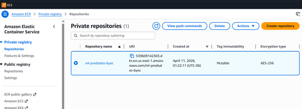
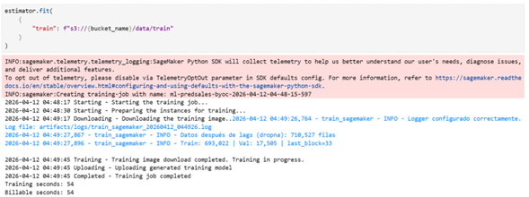
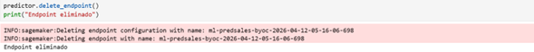
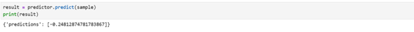

# Prediccion_ventas_Equipo10
Alondra García y Ana Paredes


## Objetivo

El objetivo del proyecto es generar un modelo de Machine Learning que prediga la demanda mensual a nivel tienda-ítem, utilizando los datos otorgados por la empresa. Se espera que el modelo reduzca el error de predicción de RMSE ~ 11 unidades a menos de 5 unidades para alcanzar el margen operativo del 8.5%


## Descripción del Proyecto

Este repositorio implementa un pipeline completo de Machine Learning para la **predicción de ventas mensuales** a nivel tienda–producto, siguiendo **buenas prácticas de código listo para producción**.

El proyecto parte de datos crudos de ventas diarias, los transforma en un dataset agregado mensual, entrena un modelo de regresión con variables temporales (lags) y genera predicciones reproducibles, incorporando logging, modularización, validaciones y estándares profesionales de calidad de código.

Este repositorio fue desarrollado con fines académicos como parte de una práctica de **scripting avanzado y preparación de código para producción**.

---

## Estructura del Repositorio

Prediccion_ventas_Equipo10/
│
├── src/
│ └── prediccion_ventas_equipo10/
│ ├── prep.py # Preparación y limpieza de datos
│ ├── train.py # Entrenamiento del modelo
│ ├── inference.py # Inferencia y generación de predicciones
│ ├── utils/
│ │ ├── features.py
│ │ ├── logging_config.py
│ │ └── init.py
│ └── init.py
│
├── scripts/
│ └── make_submission.py # Generación de archivo de submission
│
├── artifacts/
│ ├── data/ # Datasets procesados
│ ├── models/ # Modelos entrenados (.joblib)
│ ├── predictions/ # Predicciones generadas
│ ├── submissions/ # Archivo final de submission
│ ├── metrics/ # Métricas del modelo
│ └── logs/ # Logs de ejecución
│
├── README.md
└── requirements.txt


## Datos
Se utilizaron datos históricos de ventas diarias con indicadores para las tiendas y artículos obtenidos de  [Kaggle - Predict Future Sales Competition](https://kaggle.com/competitions/competitive-data-science-predict-future-sales) 

### Datasets disponibles

| Archivo | Descripción |
|---------|-------------|
| `sales_train.csv` | Datos históricos de ventas diarias (2013-2015) |
| `test.csv` | Combinaciones producto-tienda para predicción |
| `items.csv` | Información de productos y categorías |
| `shops.csv` | Información de tiendas |
| `item_categories.csv` | Categorías de productos |

Transformación: Agregación a nivel tienda–ítem–mes.


---

## Metodología
1. Limpieza y preparación de los datos.
2. Construcción de una base completa de combinaciones tienda–ítem–mes.
3. Generación de variables rezagadas (lags) de 1, 3, 6 y 12 meses.
4. División temporal de los datos en entrenamiento y validación.
5. Entrenamiento de distintos modelos (baseline, Ridge y Random Forest).
6. Selección del modelo con mejor desempeño.
7. Visualizaciones clave

Nota: Solamente se creó un notebook pero se incluyeron secciones y comentarios para poder seguir el flujo 

### Modelo final 
El modelo final seleccionado fue un Random Forest entrenado con lags temporales de 1,3,6 y 12 meses. 

## Evaluación final 
l desempeño del modelo se evaluó mediante la métrica RMSE, obteniendo un valor de 0.7049 en el conjunto de validación y un score de 1.02 privado en kaggle (1.03 score público).
Además de que más del 99% de las predicciones se encuentran dentro de un rango operativo de ±5 unidades.

## Contenido requerido
1. Clonar el repositorio:
```bash
git clone <URL_DEL_REPO>
cd Prediccion_ventas_Equipo10
Crear y activar entorno virtual:

python -m venv .venv
.\.venv\Scripts\activate
Instalar dependencias:

pip install -r requirements.txt

##Ejecución del Pipeline:
##Preparación de Datos
python -m src.prediccion_ventas_equipo10.prep


Salida:
artifacts/data/monthly_clean.csv
Logs en artifacts/logs/


## Entrenamiento del Modelo
python -m src.prediccion_ventas_equipo10.train

Salida:
Modelo entrenado en artifacts/models/
Métricas en artifacts/metrics/
Logs detallados de ejecución

## Inferencia
python -m src.prediccion_ventas_equipo10.inference

Salida:
artifacts/predictions/predictions.csv

## Generación de Submission
python scripts/make_submission.py

Salida:
artifacts/submissions/submission.csv


##Métricas del Modelo
RMSE de validación (último mes): registrado en artifacts/metrics/

Score público (Google):
1.04081

### Métricas complementarias:

- MAE
- Sesgo (predicción − valor real)
- Porcentaje de predicciones dentro de ±5 unidades

No se utilizó MAPE como métrica principal debido a la alta proporción de observaciones con ventas iguales a cero.


Sistema de Logging:
Todos los scripts implementan logging profesional:
Logs en consola y archivo
Un log por ejecución y por script
Registro de métricas, validaciones, errores y tiempos de ejecución

Ubicación:
artifacts/logs/

No se registran credenciales ni información sensible.

## Calidad de Código
Este repositorio cumple con estándares profesionales de calidad:
Formateo automático con Black
Linting con Pylint
Código modular y documentado
Uso de argparse para CLI
Docstrings y tipado


##Resultado de Pylint
10/10 (IMAGEN DE EVIDENCIA EN REPOSITORIO)


## SageMaker BYOC
lujo ejecutado en AWS
1. Datos

El dataset procesado monthly_clean.csv se subió a Amazon S3 para ser consumido por SageMaker durante el entrenamiento.

2. Imagen Docker

La imagen del contenedor se construyó y se subió a Amazon ECR con el repositorio:

ml-predsales-byoc
3. Training Job

Se ejecutó un training job en SageMaker usando:

instance_type = ml.m5.large
imagen BYOC desde ECR
datos de entrenamiento desde S3

Resultado: training job completado exitosamente.

4. Endpoint en tiempo real

Se desplegó un endpoint en SageMaker con la misma imagen para servir inferencias en tiempo real.

5. Inferencia

Se probó correctamente una inferencia real-time enviando un payload con las variables esperadas por el modelo.

Ejemplo de respuesta obtenida:

{'predictions': [-0.24812874781783867]}
Notebook de ejecución

La ejecución completa de SageMaker para esta tarea se encuentra documentada en:

notebooks/sagemaker_byoc_recovery.ipynb


Se implementó un contenedor compatible con SageMaker para training y serving sobre el directorio `algorithms/training`.

- Branch de desarrollo: `feature/sagemaker-training-byoc`
- Refactor de `algorithms/training`
- Contenedor BYOC para training
- Serving endpoint para inferencias en tiempo real
- Imagen Docker publicada en Amazon ECR
- Endpoint desplegado y probado en tiempo real

### Archivos principales
- `algorithms/training/Dockerfile.train`
- `algorithms/training/train`
- `algorithms/training/serve`
- `algorithms/training/predictor.py`
- `algorithms/training/requirements.txt`
- `algorithms/training/train.py`
- `notebooks/sagemaker_byoc_recovery.ipynb`

### Evidencia
- Imagen almacenada en Amazon ECR

- Training job completado en SageMaker

- Inferencia en tiempo real exitosa
-Endpoint desplegado

-Inferencia en tiempo real

